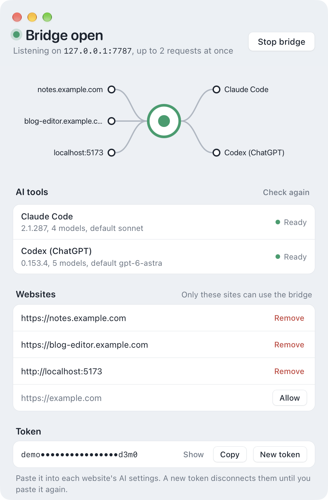

# AI Bridge

**Use the Claude Code and Codex CLIs on your computer from any web app, with no API keys.**

[](go.mod)
[](https://wails.io)
[](https://github.com/skymanrm/aibridge/actions/workflows/ci.yml)
[](https://github.com/skymanrm/aibridge/releases/latest)

[](LICENSE)

AI Bridge is a small tray app for macOS and Windows (plus a headless CLI) that exposes the AI CLIs installed on your machine,
[Claude Code](https://docs.anthropic.com/en/docs/claude-code) (`claude`) and [Codex](https://github.com/openai/codex)
(`codex`, signed in with ChatGPT), through an HTTP API on `127.0.0.1`. Requests run under your own CLI logins and
subscriptions, so no API keys are stored in your web app or sent anywhere.

<p align="center">
  
</p>

```
https://your-app (browser) ──fetch/SSE──> 127.0.0.1:7777 (AI Bridge) ──> claude -p … / codex exec …
```

## Contents

- [Features](#features)
- [Requirements](#requirements)
- [Installation](#installation)
- [Quick start](#quick-start)
- [Configuration](#configuration)
- [API](#api)
- [n8n studio](#n8n-studio)
- [Security](#security)
- [Development](#development)
- [Releasing](#releasing)
- [License](#license)

## Features

- **Chat over SSE**: streams answers from Claude Code or Codex, with a choice of model and reasoning effort.
- **Image generation** through Codex's built-in `image_gen` tool, returned inline as base64.
- **n8n screenshots**: AI-designed n8n workflows rendered in a real n8n editor (Docker) for posts about automation.
- **Menu bar / tray app**: a live map of websites → bridge → AI tools, the detected CLIs, the website allowlist, the token
  and recent requests with request/response details.
- **Headless CLI** for servers and scripts. It runs the same server and reads the same config.
- **Locked down by default**: loopback only, origin allowlist, bearer token, and sandboxed CLI runs.

## Requirements

- macOS 11+ (Apple Silicon or Intel) or Windows 10/11 (x64). The headless CLI also runs on Linux.
- At least one AI CLI, installed and logged in:
  - [Claude Code](https://docs.anthropic.com/en/docs/claude-code) (`claude`)
  - [Codex CLI](https://github.com/openai/codex) (`codex`), signed in with ChatGPT
- To build from source: Go 1.26+, Node.js, and [Wails v2](https://wails.io) for the app
- Optional: Docker (OrbStack or Docker Desktop), only for the [n8n studio](#n8n-studio)

## Installation

### Download

Grab the latest build from [Releases](https://github.com/skymanrm/aibridge/releases/latest):

| File | Platform |
|---|---|
| `AI-Bridge-<version>-macos-universal.zip` | macOS app (Apple Silicon and Intel) |
| `AI-Bridge-<version>-windows-amd64-setup.exe` | Windows installer |
| `AI-Bridge-<version>-windows-amd64-portable.zip` | Windows app, no install |
| `ai-bridge-<version>-<os>-<arch>.tar.gz` / `.zip` | Headless CLI for macOS, Linux and Windows |
| `SHA256SUMS` | Checksums for all of the above |

The builds are not signed with an Apple Developer ID or a Windows code-signing certificate:

- **macOS**: move **AI Bridge.app** to `/Applications`, then right-click it → **Open** the first time, or run
  `xattr -dr com.apple.quarantine "/Applications/AI Bridge.app"`.
- **Windows**: if SmartScreen warns about an unknown publisher, choose **More info** → **Run anyway**.

### Using the app

- **macOS**: AI Bridge lives in the menu bar, not the Dock. The icon dims when the bridge is stopped and shows how many
  requests are in flight.
- **Windows**: AI Bridge lives in the notification area (system tray). Click the icon to open the window; right-click
  it for Start/Stop and Quit.

The bridge starts on `127.0.0.1:7777` when the app opens. Closing the window keeps the bridge running; reopen the window
or quit from the tray icon. Launching the app again just brings the existing window back.

On Windows, both the native installers and npm global installs of `claude` / `codex` are detected. npm `.cmd` shims are
run directly through `node.exe`, never through `cmd.exe`.

### Build from source

```sh
git clone https://github.com/skymanrm/aibridge.git && cd aibridge
go install github.com/wailsapp/wails/v2/cmd/wails@v2.16.0   # once
make app              # macOS, Apple Silicon -> build/bin/AI Bridge.app
make app-universal    # macOS, Apple Silicon + Intel
make app-windows      # Windows x64 -> build/bin/AI Bridge.exe (also works from macOS)
```

### Headless CLI

```sh
go install github.com/skymanrm/aibridge/cmd/ai-bridge@latest
# or, from a clone:
make cli              # -> ./ai-bridge
```

```text
ai-bridge serve [--port N]   run the HTTP bridge on 127.0.0.1 (default command)
ai-bridge providers          list detected AI CLIs and their models
ai-bridge token [--rotate]   print (or regenerate) the token web apps must send
ai-bridge allow <origin>     allow a website (applies without restart)
ai-bridge deny <origin>      remove a website from the allowlist
ai-bridge origins            list allowed websites
ai-bridge version
```

## Quick start

1. Allow your website, either in the app's **Websites** section or with `ai-bridge allow https://app.example.com`.
2. Copy the token (**Copy** in the app, or `ai-bridge token`) and paste it into your web app's settings.
3. Call the bridge from the browser:

```js
const res = await fetch('http://127.0.0.1:7777/v1/chat', {
  method: 'POST',
  headers: { 'Content-Type': 'application/json', Authorization: `Bearer ${token}` },
  body: JSON.stringify({
    provider: 'claude',            // or 'codex'
    model: 'sonnet',               // optional, see GET /v1/providers
    system: 'You are a concise assistant.',
    messages: [{ role: 'user', content: 'Summarize this note in one sentence: …' }],
  }),
})

// Server-sent events: start, delta {text}*, then done {text, usage} or error {code, message}
const reader = res.body.pipeThrough(new TextDecoderStream()).getReader()
let buf = ''
for (;;) {
  const { value, done } = await reader.read()
  if (done) break
  buf += value
  let i
  while ((i = buf.indexOf('\n\n')) >= 0) {
    const chunk = buf.slice(0, i); buf = buf.slice(i + 2)
    const event = chunk.match(/^event: (.*)$/m)?.[1]
    const data = JSON.parse(chunk.match(/^data: (.*)$/m)?.[1] ?? 'null')
    if (event === 'delta') console.log(data.text)
  }
}
```

## Configuration

The app and the CLI share `~/.config/ai-bridge/config.json` (`%USERPROFILE%\.config\ai-bridge\config.json` on
Windows), created on first run with mode `0600`. Set
`AI_BRIDGE_CONFIG` to use a different file.

| Key | Default | Description |
|---|---|---|
| `port` | `7777` | Listen port on `127.0.0.1` |
| `token` | random | Bearer token web apps must send |
| `origins` | `[]` | Allowed website origins, e.g. `https://app.example.com` |
| `max_concurrent` | `2` | Maximum number of CLI runs at the same time |
| `timeout_sec` | `300` | Timeout for each run, in seconds |
| `binaries` | auto-detect | Override CLI paths, e.g. `{"claude": "/path/to/claude"}` (also `codex`, `docker`) |

## API

Every endpoint except `/health` requires `Authorization: Bearer <token>`. Streaming endpoints respond with
server-sent events.

| Method | Path | Description |
|---|---|---|
| GET | `/health` | `{name, version, authorized}` |
| GET | `/v1/providers[?refresh=1]` | Detected CLIs: `{providers: [{id, name, available, version, default_model, models: [{id, name, efforts?}], efforts, capabilities, error}]}` |
| POST | `/v1/chat` | `{provider, model?, effort?, system, messages: [{role: user\|assistant, content}]}` → SSE `start`, `delta {text}`*, `done {text, provider, model, usage}` or `error {code, message}` |
| POST | `/v1/image` | Providers with the `image` capability (Codex): `{provider, model?, effort?, prompt, size?: "WxH"\|"auto"}` → SSE `start`, `delta {text}`*, `done {images: [{mime, data (base64)}], text, provider, model, usage}` or `error` |
| GET | `/v1/n8n` | n8n studio status: `{available (docker found), running, n8n_version, editor_url, error}` |
| POST | `/v1/n8n/screenshot` | `{provider, model?, effort?, prompt \| workflow, size?: "WxH" (CSS px, rendered at 2x), theme?: light\|dark, frame?: editor\|canvas, layout?: auto\|keep}` → SSE `start`, `delta {text}`* (progress), `done {images, workflow, issues, notes, attempts, n8n_version, text, …}` or `error` |

Notes:

- Codex sends its answer as a single `delta` because its CLI does not stream tokens.
- `/v1/image` uses Codex's built-in `image_gen` tool. The files it saves under
  `$CODEX_HOME/generated_images/<thread>/` are returned inline and then deleted.

## n8n studio

`/v1/n8n/screenshot` produces real n8n editor screenshots for posts about automation. Everything runs in Docker,
so the host only needs the `docker` CLI.

- `bridge/studio/` is embedded in the binary and written to `~/.config/ai-bridge/studio/`. It is a Compose project,
  `ai-bridge-studio`, with a pinned `n8nio/n8n` and a Playwright capture service on `127.0.0.1:7778`. The first
  request runs `docker compose up --build --wait`, which takes a few minutes once. Later requests reuse the running stack.
- The AI designs the workflow JSON from the prompt in `bridge/n8n_prompt.md`. The capture service then checks node
  types against n8n's catalogue, fixes node versions, attaches placeholder credentials, imports the workflow, reads node
  warnings from the canvas and takes the screenshot. Unknown nodes and warnings go back to the AI for up to 3 attempts.
  The imported workflow is deleted afterwards.
- Pass `workflow` instead of `prompt` to render your own workflow JSON without the AI step.
- The studio's n8n editor is at http://127.0.0.1:7779 (local-only login `studio@ai-bridge.local` / `AiBridge-Studio-1`).
  Stop it with `docker compose -p ai-bridge-studio down`.

## Security

- Listens on `127.0.0.1` only. Requests with a non-loopback `Host` header are rejected to block DNS rebinding.
- Browser requests must come from an allowlisted `Origin`, and every call except `/health` needs the token.
- CLIs run in an empty temp directory with no tools (`claude --tools ""`, without user settings or MCP servers) or in a
  read-only sandbox (`codex --sandbox read-only --ignore-user-config`), so a prompt cannot touch your files.

## Development

```sh
make test        # go test -race ./bridge/...
wails dev        # run the app with frontend hot reload
```

CI runs `go vet` and the tests on macOS, Windows and Linux for every push and pull request.

Project layout:

```
bridge/            HTTP server, providers (claude, codex), config, n8n studio
bridge/studio/     Docker Compose project: n8n + Playwright capture service
cmd/ai-bridge/     headless CLI
frontend/          app window (Vite + TypeScript)
app.go, main.go    Wails app; tray_darwin.* / tray_windows.go are the tray icons
.github/workflows/ CI and release builds
```

## Releasing

Create a release with a `vX.Y.Z` tag on GitHub, or from the terminal:

```sh
gh release create v0.3.0 --generate-notes
```

When a release is published, the [Release workflow](.github/workflows/release.yml) builds and attaches:

- the macOS universal app (ad-hoc signed `.zip`)
- the Windows NSIS installer and a portable `.zip`
- headless CLI archives for darwin/arm64, darwin/amd64, linux/amd64, linux/arm64 and windows/amd64
- `SHA256SUMS`

The version comes from the tag. It is written into `wails.json` (app metadata) and `bridge.Version` (the `/health`
response) at build time. To rebuild an existing release, run the workflow manually with its tag.

## License

[MIT](LICENSE) © Andrey Fanyagin
